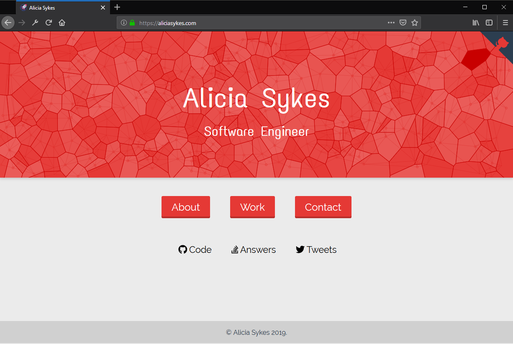

# The homepage for Alicia Sykes

Live app: [https://aliciasykes.com](https://aliciasykes.com)

This is the source code for my personal homepage. It was made possible, thanks to the amazing [Vue.js](https://vuejs.org/) framework.

I've made the code open source, so that anyone who would like to can use the components I built as part of it. Everything's tested and documented.

## Running Locally

- **Grab the source code** `git clone https://github.com/Lissy93/alicia-sykes-website.git`
- **Fetch dependencies** `yarn install`
- **Compile (with hot-reload!) for development** `yarn run serve`
- **Compile and minify ready for production** `yarn run build`
- **Run the tests** `yarn run test`
- **Lints and auto-fixes files** `yarn run lint`
- **Run the end-to-end tests** `yarn run test:e2e`

## Screenshot

[](public/screenshots)

## NGINX Conf

To work nicley with NGINX, I've used the following config. (note the `try_fils` line, allows user to land on a sub-page, without dying)

```
server {

    listen 80;

    server_name aliciasykes.com www.aliciasykes.com aliciasykes.as93.net www.aliciasykes.as93.net;

    location / {
        proxy_pass http://localhost:3002;
        proxy_http_version 1.1;
        proxy_set_header Upgrade $http_upgrade;
        proxy_set_header Connection 'upgrade';
        proxy_set_header Host $host;
        proxy_cache_bypass $http_upgrade;
        try_files $uri $uri/ /index.html;
    }

}
```

## License

Copyright 2019 Alicia Sykes

Permission is hereby granted, free of charge, to any person obtaining a copy of this software and associated documentation files (the "Software"), to deal in the Software without restriction, including without limitation the rights to use, copy, modify, merge, publish, distribute, sublicense, and/or sell copies of the Software, and to permit persons to whom the Software is furnished to do so, subject to the following conditions:

The above copyright notice and this permission notice shall be included in all copies or substantial portions of the Software.

THE SOFTWARE IS PROVIDED "AS IS", WITHOUT WARRANTY OF ANY KIND, EXPRESS OR IMPLIED, INCLUDING BUT NOT LIMITED TO THE WARRANTIES OF MERCHANTABILITY, FITNESS FOR A PARTICULAR PURPOSE AND NONINFRINGEMENT. IN NO EVENT SHALL THE AUTHORS OR COPYRIGHT HOLDERS BE LIABLE FOR ANY CLAIM, DAMAGES OR OTHER LIABILITY, WHETHER IN AN ACTION OF CONTRACT, TORT OR OTHERWISE, ARISING FROM, OUT OF OR IN CONNECTION WITH THE SOFTWARE OR THE USE OR OTHER DEALINGS IN THE SOFTWARE.